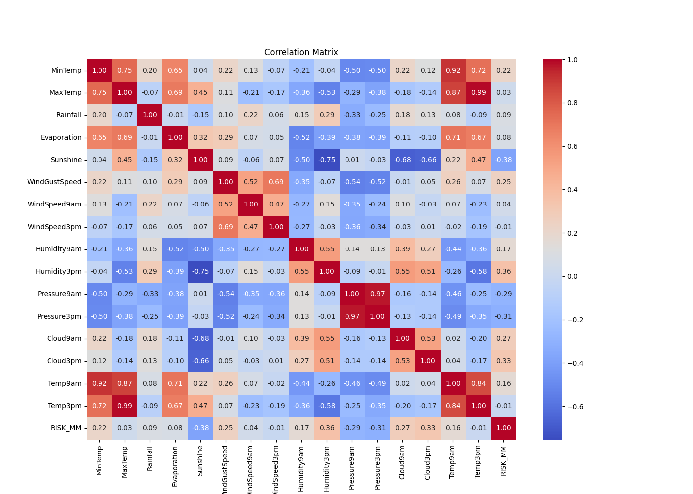
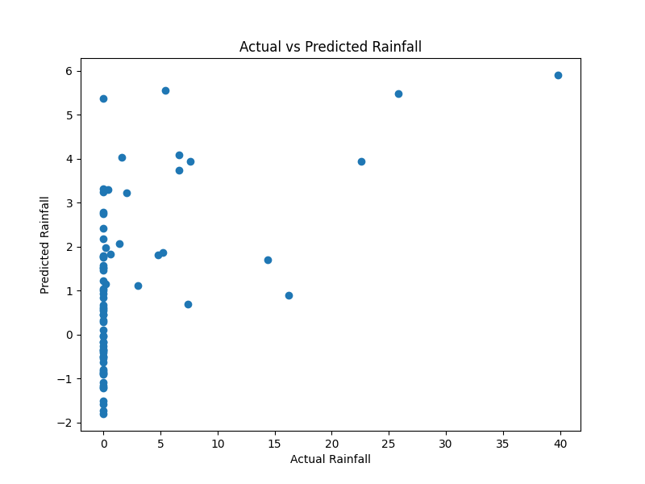
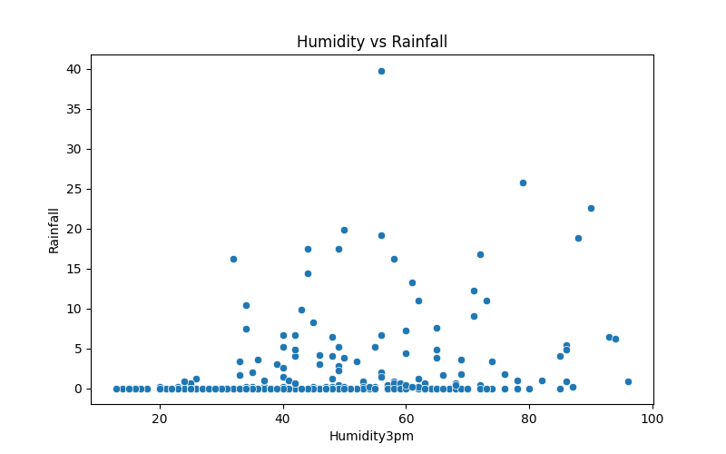

# Weather Data Analysis and Rainfall Prediction

## Overview

This project performs Exploratory Data Analysis (EDA) and Machine Learning on weather data to predict rainfall and identify important weather patterns.

## Technologies Used

* Python
* Pandas
* NumPy
* Matplotlib
* Seaborn
* Scikit-Learn

## Features

* Missing Value Analysis
* Correlation Analysis
* Rainfall Distribution
* Outlier Detection
* Rain Today / Rain Tomorrow Analysis
* Humidity vs Rainfall Analysis
* Machine Learning Models

  * Linear Regression
  * Decision Tree Regressor
  * Random Forest Regressor

## Model Evaluation Metrics

* MAE
* MSE
* RMSE
* R² Score

## Project Outputs

### Correlation Matrix



### Actual vs Predicted Rainfall



### Feature Importance


### Humidity vs Rainfall



## How to Run

```bash
pip install -r requirements.txt
python weather_analysis.py
```

## Author

Arshpreet Singh
B.Tech Computer Science Engineering
