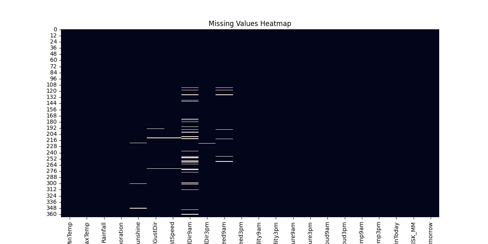
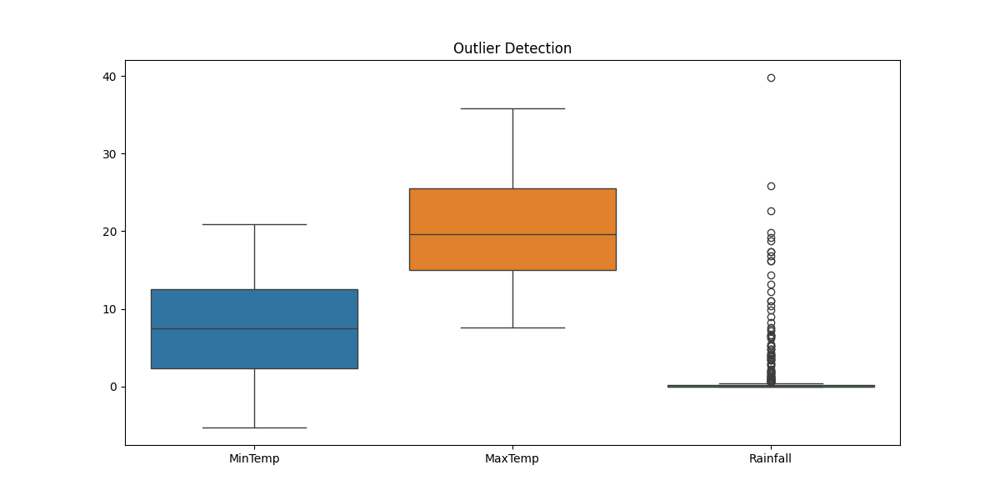
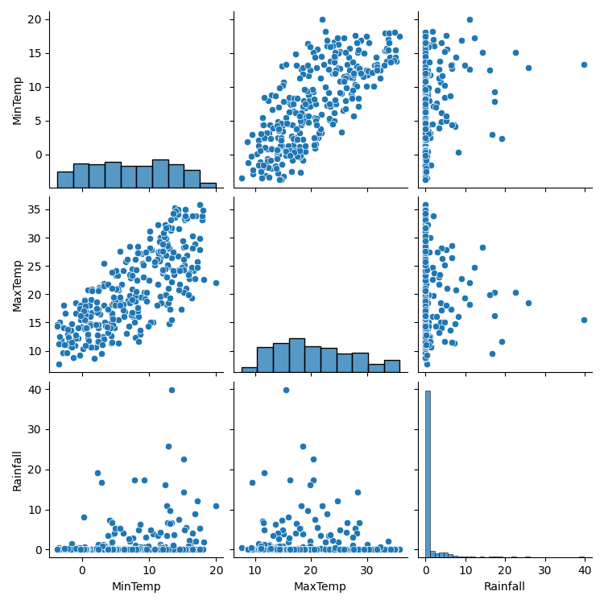
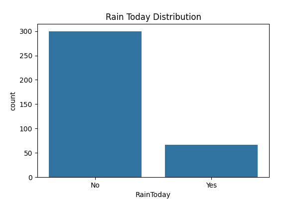
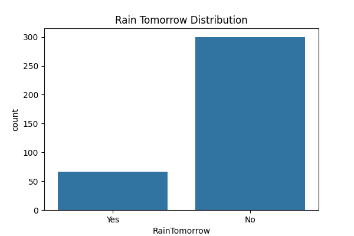
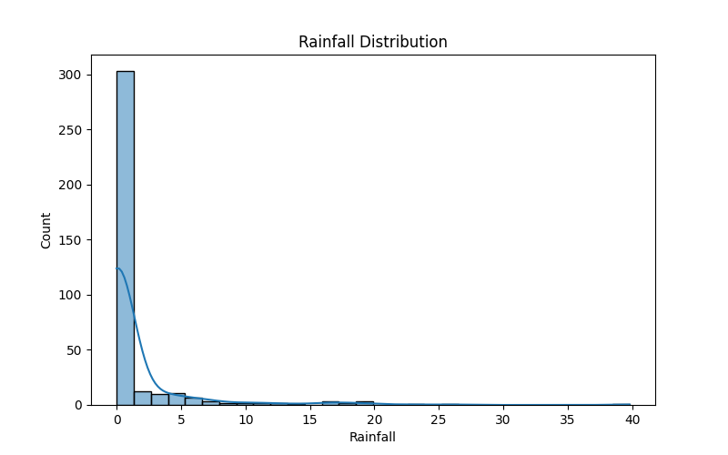

# Weather Data Analysis and Rainfall Prediction

## Overview

This project performs Exploratory Data Analysis (EDA) and Machine Learning on weather data to analyze weather patterns and predict rainfall. The project includes data preprocessing, visualization, statistical analysis, and model comparison using multiple machine learning algorithms.

---

## Features

* Missing Value Analysis
* Correlation Analysis
* Rainfall Distribution Analysis
* Outlier Detection
* Rain Today / Rain Tomorrow Analysis
* Humidity vs Rainfall Analysis
* Machine Learning-Based Rainfall Prediction
* Model Performance Comparison
* Actual vs Predicted Visualization

---

## Technologies Used

* Python
* Pandas
* NumPy
* Matplotlib
* Seaborn
* Scikit-Learn

---

## Machine Learning Models

* Linear Regression
* Decision Tree Regressor
* Random Forest Regressor

---

## Evaluation Metrics

* Mean Absolute Error (MAE)
* Mean Squared Error (MSE)
* Root Mean Squared Error (RMSE)
* R² Score

---

# Project Outputs

## Correlation Matrix


---

## Actual vs Predicted Rainfall


---

## Humidity vs Rainfall


---

## Missing Values Heatmap



---

## Outlier Detection



---

## Pair Plot



---

## Rain Today Distribution



---

## Rain Tomorrow Distribution



---

## Rainfall Distribution



---

## Dataset Features

The dataset contains weather-related attributes such as:

* MinTemp
* MaxTemp
* Rainfall
* Evaporation
* Sunshine
* Wind Speed
* Humidity
* Pressure
* Cloud Coverage
* RainToday
* RainTomorrow

---

## Project Structure

```text
Weather_Analysis_Project/
│
├── weather_analysis.py
├── weather.csv
├── requirements.txt
├── README.md
├── INSTRUCTIONS.txt
│
├── analysis_report.txt
├── model_performance.csv
├── weather_summary.csv
│
└── images/
    ├── actual_vs_predicted.png
    ├── correlation_matrix.png
    ├── humidity_vs_rainfall.png
    ├── missing_values_heatmap.png
    ├── outlier_detection.png
    ├── pairplot.png
    ├── rain_today_distribution.png
    ├── rain_tomorrow_distribution.png
    └── rainfall_distribution.png
```

---

## Installation

```bash
pip install -r requirements.txt
```

---

## Run the Project

```bash
python weather_analysis.py
```

---

## Generated Outputs

After execution, the project generates:

* Analysis Report (.txt)
* Weather Summary (.csv)
* Model Performance Report (.csv)
* Multiple Visualization Graphs (.png)

---

## Author

Arshpreet Singh

B.Tech Computer Science Engineering

Data Science Intern | Machine Learning Enthusiast
